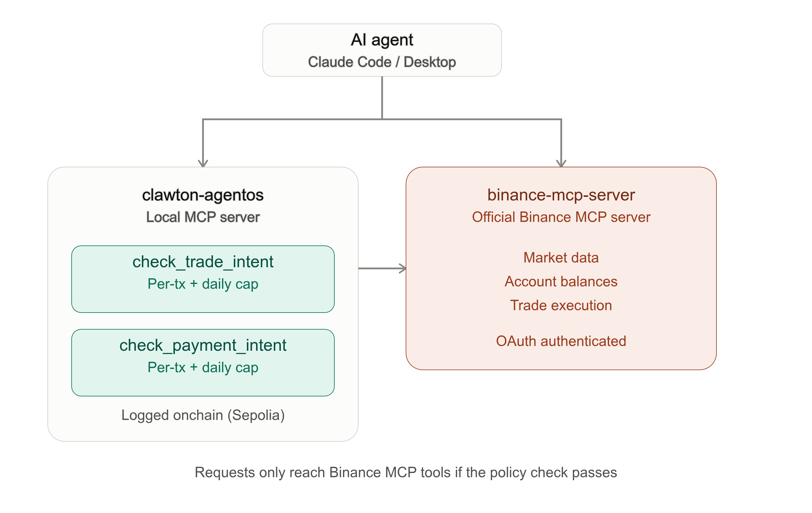

# clawton-agentos

**A policy enforcement layer between an AI agent and Binance Agent OS's official MCP server.**

## Summary

Binance Agent OS gives AI agents direct trading and payment access to a dedicated Agentic sub-account through an official MCP server. That server handles execution and confirmation, but the pre-execution policy layer — spend caps, cumulative limits, onchain audit trails — is left to the developer to build.

clawton-agentos is a local MCP server that sits alongside Binance's official `binance-mcp-server` inside the same AI agent session (tested with both Claude Code and Claude Desktop). Before any trade or x402 payment intent reaches Binance's MCP tools, it is evaluated against a configurable policy — a per-transaction spend cap and a rolling daily cumulative cap — and every decision, allowed or denied, is recorded onchain to a dedicated audit-log smart contract on Ethereum Sepolia.

## Design principle

**The policy decides, not the agent.** The agent is instructed — and, per its own tool descriptions, expected — to call this server's policy-check tools before calling any Binance MCP execution tool. If the check fails, nothing is forwarded — no trade, no payment — regardless of how the agent frames the request.

## Architecture



The two servers are independent — there is no direct code link between them. The agent itself is the bridge: it is expected to call `clawton-agentos`'s tools first, and only proceed to Binance's execution tools if the policy check returns `allowed: true`.

## Components

| File | Purpose |
|---|---|
| `policy.js` | Core policy logic: `checkSpendIntent` — per-transaction cap, rolling 24h cumulative cap, local JSON ledger (`spend-log.json`), onchain audit logging via `cast send` |
| `index.js` | MCP server exposing `check_trade_intent` and `check_payment_intent` as tools, via `@modelcontextprotocol/sdk` (stdio transport) |
| `test-policy.js` | Unit tests for the policy logic, run in isolation (no live network calls) |

## Policy rules

- **Per-transaction cap:** $50 per trade or payment
- **Daily cumulative cap:** $200, tracked in a rolling 24-hour window, shared across both trade and payment intents
- Any invalid intent (missing fields, non-positive value) is denied
- Every decision — allowed or denied — is logged onchain when `PRIVATE_KEY` and `RPC_URL` are set in the environment of the session running the MCP server; if they are not set, onchain logging is skipped (logged as `{skipped: true}`) and the policy check still runs normally

## Onchain audit log

Every policy decision is written to a `logDecision(string,string,string,string,string)` event on an audit-log smart contract deployed on Ethereum Sepolia:

**Contract address:** `0x86b8ED1803c99768D67a81ed1d1a1F9f8f517269` ([view on Etherscan](https://sepolia.etherscan.io/address/0x86b8ED1803c99768D67a81ed1d1a1F9f8f517269))

This contract was already deployed and independently security-reviewed (Slither, Aderyn, Mythril static/symbolic analysis) prior to this project, with 100% unit test line coverage — it is not new code written for this submission. Reusing an already-audited, already-deployed contract for onchain logging here was a deliberate choice over deploying a new, unaudited one under time pressure.

## What's been verified end-to-end

- Real OAuth connection to Binance Agent OS's official MCP server (`https://agent.binance.com/mcp/agentic`) from Claude Code, authenticated against a real Binance.com account
- Live market data retrieval through the connected Binance MCP server (real-time BTCUSDT price and 24h stats)
- A trade intent ($25 BTCUSDT) evaluated by `check_trade_intent`, approved by policy, and correctly halted by the agent when the Agentic sub-account had no funds — no order was attempted against an empty account
- **A real trade executed end to end**: with the Agentic sub-account funded with $3, a $2 BNB market buy was approved by `check_trade_intent` and then placed through `binance-mcp-server`, filling for 0.006 BNB at ~$750.52. The resulting balance (0.00599550 BNB plus USDT change) was independently confirmed via a separate balance query against `binance-mcp-server`, not just the agent's own summary of the trade.
- A payment intent ($15, x402-style) evaluated by `check_payment_intent` and approved by policy
- **Onchain audit logging, confirmed independently multiple times**: trade-intent and payment-intent checks produced real Sepolia transactions when `PRIVATE_KEY`/`RPC_URL` were present in the session, and a separate, later `cast logs` query against the deployed contract confirmed the event data matches exactly what was reported at check time
- Both `clawton-agentos` and `binance-mcp-server` connected successfully as MCP servers from both Claude Code and Claude Desktop

## Known limitations (honest, current state)

- **Onchain logging depends on environment variables being present in the exact session running the MCP server.** `PRIVATE_KEY`/`RPC_URL` must be exported in the same terminal session before launching Claude Code (or set in Claude Desktop's process environment) — a new session or a differently-launched client will silently skip onchain logging (`{skipped: true}`) even though the policy check itself still runs correctly. This was observed directly during testing: one trade execution completed successfully without a prior onchain log because the session lacked these variables, while a subsequent explicit policy check in a properly configured session did produce a real onchain transaction.
- **Local ledger, not onchain-derived.** The daily cap is tracked in a local JSON file (`spend-log.json`), not read from an onchain cumulative-spend contract. This is a simpler, faster-to-build approach appropriate for this project's scope.
- **Claude Desktop integration is less stable than Claude Code.** The MCP connection to `clawton-agentos` from Claude Desktop was observed disconnecting unexpectedly at least once during testing, and required re-adding to its config file. Claude Code is the fully verified, stable integration path; Claude Desktop support is best-effort.
- **The new server code itself is not independently security-audited.** The audit-log contract it writes to was previously reviewed; `policy.js` and `index.js` are unit-tested but have not been through static analysis.
- **Testnet-only for logging.** All onchain logging targets Ethereum Sepolia. The Binance Agent OS connection itself is necessarily against a real Binance account (Binance Agent OS has no sandbox/testnet); testing was done with a small, intentionally limited real balance ($3) in the Agentic sub-account.

## Setup

### Prerequisites
- Node.js 18+
- A real Binance.com account (Binance Agent OS has no sandbox/testnet)
- Claude Code or Claude Desktop, both of which support connecting to multiple MCP servers in one session
- (Optional, for onchain logging) `PRIVATE_KEY` and `RPC_URL` environment variables for a funded Sepolia wallet, exported in the same session that launches the client, and `cast` (Foundry) installed

### Install
```bash
git clone <this-repo-url>
cd clawton-agentos
npm install
```

### Connect to Claude Code
```bash
claude mcp add clawton-agentos --transport stdio node $(pwd)/index.js
claude mcp add binance-mcp-server --transport http https://agent.binance.com/mcp/agentic
claude
```
Inside Claude Code, run `/mcp`, select `binance-mcp-server`, and authenticate — this opens Binance's real OAuth consent screen and creates (or reuses) an Agentic sub-account.

### Connect to Claude Desktop
Add to `~/.config/Claude/claude_desktop_config.json` (Linux path):
```json
{
  "mcpServers": {
    "clawton-agentos": {
      "command": "node",
      "args": ["/absolute/path/to/clawton-agentos/index.js"]
    }
  }
}
```
Restart Claude Desktop, then add `binance-mcp-server` via **Settings → Connectors → Add custom connector**, using `https://agent.binance.com/mcp/agentic`.

### Run the unit tests
```bash
node test-policy.js
```

### Try it
In either client, once both servers are connected:I want to buy $25 of BTCUSDTThe agent should call `check_trade_intent` before attempting anything on `binance-mcp-server`. If your Agentic sub-account is unfunded, execution will correctly stop there.

## Background

This project builds on patterns and infrastructure from [Clawton](https://github.com/0xR-1/Clawton), an existing personal project applying the same "the policy decides, not the agent" principle to Binance Spot Testnet trading and x402 payments via a Newton Protocol (Rego/WASM) policy engine. The audit-log contract used here for onchain logging is reused, unmodified, from that project. clawton-agentos targets a different, newer surface — Binance's officially hosted Agent OS MCP infrastructure — with a simpler policy engine suited to that scope.

## License

MIT
